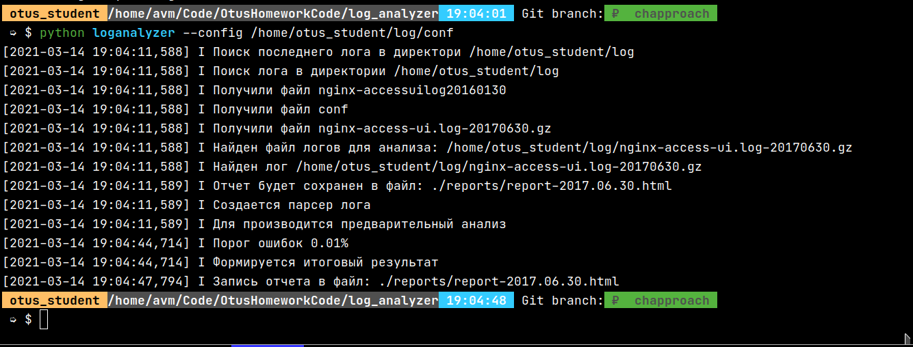
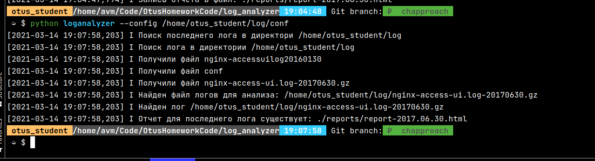
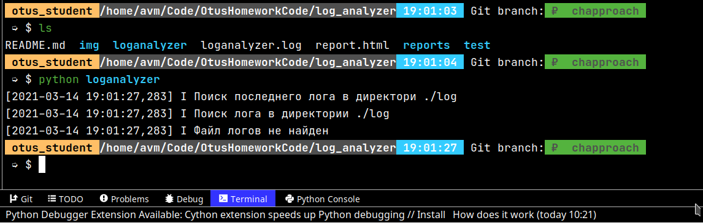
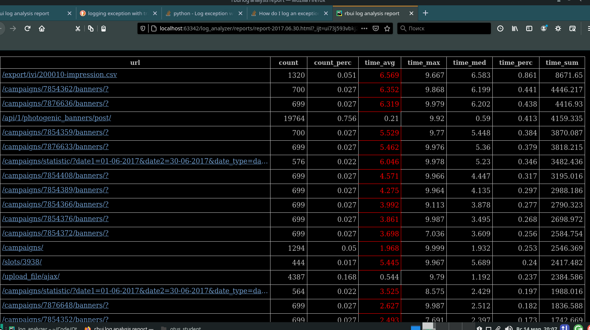

# Анализатор логов

## Запуск

В командной строке:

    python log_analyzer.py
 
Находит последний файл по дате в названиии лога. В папке указаной в самом скрипте.

Или возможно указать конфигурационный файл:

    python log_analyzer.py --config <path to file>

## Тесты

Тесты запускаются из пакета loganalyzer(там где __main__.py и __init__.py) командой:

    python -m unittest discover -s '..'

## Запуск скрипта

Успешный запуск

Повторный запуск. Если файл отчета существует в директории reports, происходит выход из программы.

Лог не найден 

Отчет.

Количество строк из config['REPORT_SIZE']. Отсортировано по time_sum каждого url.

